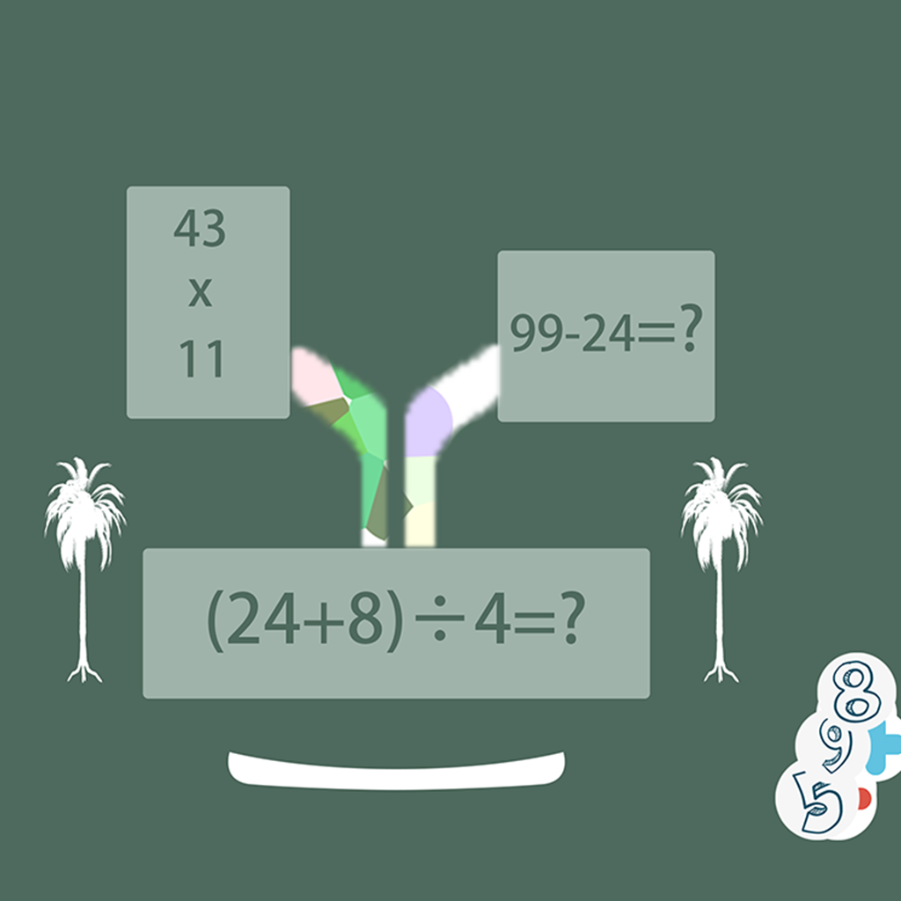

## Welcome to My Fun Equation Exercise

This is an interesting equation practice tool. You need to add a set of 4 specific numbers and an arithmetic type to yourself. At the beginning of each practice, you need to use the number and arithmetic type you selected to form the first equation. The second equation will contain a randomly generated number. You need to fill in the blank so that the sum of the answer of the second equation and the answer of the first equation is 1, for example: (x + y)% 3 = 1.

If you have any questions, you can either leave a message or send the questions to our email address.

We will answer them for you in the first time.

### Address: zhanghesongyuan7@126.com

Thank you!
